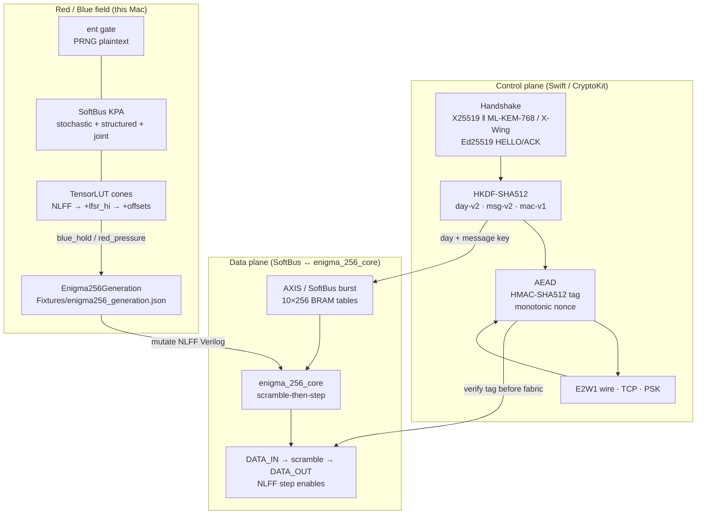
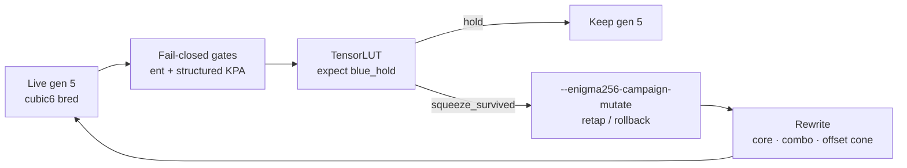

# Specification: Enigma 256 (E256) — Polymorphic Stream Cipher

## Abstract

**E256** is a software-defined, SoftBus-accelerated stream cipher that keeps the reciprocal rotor *contract* of historical Enigma while deleting every leak the U-534 / P1030680 campaign proved fatal: 26-letter menus, the self-stecker ban, thin plugboards, odometer stepping, and paper day keys. Control-plane crypto (hybrid KEM, HKDF-SHA512, AEAD, Ed25519) never enters the datapath BRAMs. The live field is **Apple Silicon SoftBus** — no FPGA board on the critical path. Red Team pressure (TensorLUT, SoftBus KPA, `ent`) and Blue generation rolls share one Mac.

## Architecture overview



### Byte path (reciprocal)

```mermaid
flowchart LR
  PT["PT byte"] --> PB1["plugboard"]
  PB1 --> R1F["R1 fwd ±off"]
  R1F --> R2F["R2 fwd ±off"]
  R2F --> R3F["R3 fwd ±off"]
  R3F --> R4F["R4 fwd ±off"]
  R4F --> REF["un-reflector<br/>fixed points OK"]
  REF --> R4R["R4 rev ±off"]
  R4R --> R3R["R3 rev ±off"]
  R3R --> R2R["R2 rev ±off"]
  R2R --> R1R["R1 rev ±off"]
  R1R --> PB2["plugboard"]
  PB2 --> CT["CT byte"]
```



Encrypt ≡ decrypt under the same machine state. After each byte: NLFF step enables advance offsets; Galois LFSR clocks.

### Planes and trust boundary

| Plane | Runs where | Owns |
|-------|------------|------|
| **Control** | Host Swift | Handshake, IKM, HKDF, AEAD tag verify, nonce counter, `E2W1` |
| **Data** | SoftBus / `enigma_256_core` | BRAM tables, LFSR+NLFF, scramble stream |
| **Red** | Yosys + TensorLUT + SoftBus oracles | Cone melt, KPA, `ent`, campaign ledger |
| **Blue genes** | `Fixtures/enigma256_generation.json` | NLFF formula/taps, HKDF generation labels |

## 1. Architectural corrections (the core machine)

- **Base-256:** alphabet is `0x00…0xFF`; classical 26-letter menus do not transfer.
- **Un-reflector:** involution **with** fixed points — blinds crib self-stecker placement. (Encrypting zeros is *not* a keystream test; ~30% `scramble(0)==0` is expected.)
- **Full-spectrum plugboard:** 128-pair base-256 involution from day-key OKM.
- **Galois LFSR + NLFF stepping:** all four active rotors can move every byte; step enables are non-linear folds, not raw LFSR taps.

## 2. Ephemeral key distribution (handshake)

Control plane only — never in BRAM fabric.

- Ephemeral **X25519**; hybrid **ML-KEM-768** (macOS 26+) → `IKM = X25519_SS ‖ ML-KEM_SS`; optional **X-Wing**.
- Long-term **Ed25519** identities sign hybrid HELLO/ACK (`Enigma256Auth`).
- `burn()` for PFS when the session ends.

## 3. State initialization & key derivation

**HKDF-SHA512** (RFC 5869). Labels: `enigma256-day-v2`, `enigma256-msg-v2`, `enigma256-ecdh-v2`, `enigma256-mac-v1` (plus generation-scoped day/msg info from live genes).

- IKM: ECDH / hybrid / **PBKDF2-HMAC-SHA512** passphrase (default width 64 B).
- Day OKM: plugboard + 16-rotor pool + un-reflector.
- MAC key: separate expand — never reused as stream material.

## 4. Message transmission, AEAD & nonce discipline

- Nonce → Walzenlage (4 of 16), Grundstellung, LFSR seed (micro-HKDF).
- **E256** containers ver=2: HMAC-SHA512 (32-byte tag) over `nonce ‖ ciphertext`. Wire **verifies before** SoftBus/AXI.
- `Enigma256ProtectedSession`: `random[8] ‖ counter_be[8]`; reject nonce reuse under one IKM.

## 5. Non-linear LFSR stepping (NLFF)

Primitive Galois taps 64, 63, 61, 60 → feedback `0xD800_0000_0000_0000`.

| Gen | Formula | Outcome |
|-----|---------|---------|
| 0–2 | `quadratic3` `(a∧b)⊕c` | TensorLUT repeatedly squeezed |
| 3 | `cubic6` fixed taps | TensorLUT hard; **dead middle rotors** |
| 4 | `coupledCubic6` | **Rejected** — correlates steps |
| **5 live** | `cubic6` **bred taps** | ~0.5 rates, low φ; SoftBus field |

Gen 5 folds (`Fixtures/enigma256_generation.json`):

```
step_r1 = (lfsr[4]  & lfsr[15] & lfsr[17]) ^ (lfsr[23] & lfsr[26]) ^ lfsr[61]
step_r2 = (lfsr[7]  & lfsr[9]  & lfsr[31]) ^ (lfsr[38] & lfsr[50]) ^ lfsr[59]
step_r3 = (lfsr[30] & lfsr[43] & lfsr[46]) ^ (lfsr[49] & lfsr[51]) ^ lfsr[60]
step_r4 = (lfsr[12] & lfsr[29] & lfsr[54]) ^ (lfsr[55] & lfsr[57]) ^ lfsr[62]
```

Swift (`Enigma256LFSR.stepMask`) and `enigma_256_core.v` agree. Grade balance with `--enigma256-nlff-stats` / breed with `--enigma256-nlff-breed` **before** celebrating TensorLUT holds. Blue evolves **stronger stepping crypto**; TensorLUT hardness is a constraint, not a trade for correlated rotors.

## 6. Red / Blue evolutionary loop



- **Red:** SoftBus stochastic KPA, structured hill-climb (partial leak + **day-only joint**), `ent` (PRNG PT), TensorLUT on expanding cones.
- **Blue:** Under pressure, mutate genes + rewrite NLFF lines in `enigma_256_core.v`, `enigma_256_nlff_combo.v`, `enigma_256_nlff_lfsr_combo.v`, `enigma_256_nlff_offset_combo.v`, step cone.

### TensorLUT adversarial cones (growing surface)

| Cone | Module | ~LUT6 | Meaning |
|------|--------|------:|---------|
| NLFF | `enigma_256_nlff_combo` | 4 | Step enables only |
| + LFSR hi | `enigma_256_nlff_lfsr_combo` | 8 | + `lfsr_next[63:56]` |
| **Past NLFF** | `enigma_256_nlff_offset_combo` | ~47 | + `next_ri = offset_ri + step_ri` |
| Full core | `enigma_256_core` | — | **Deferred** (BRAM melt) |

## 7. Deployment field (Apple Silicon)

- SoftBus = AXI/AXIS stand-in; iverilog co-sim + Yosys/TensorLUT = Red harness.
- COTS PL board optional — **not** on the critical path.
- Optional `SCA_CTRL` stream jitter; dual-rail / masked LUTs remain HA synthesis.

## 8. Implementation status

- **Oracle / core:** `Enigma256.swift` ↔ `enigma_256_core.v`. Golden: `Scripts/enigma256_sim.sh`.
- **Session / AEAD:** `Enigma256Context`, `Enigma256AEAD`, `Enigma256ProtectedSession`; `E256` ver=2.
- **AXI / SoftBus:** Lite + AXIS table burst (`enigma_256_axis_tables.v`); SoftBus burst + jitter. Co-sim: `Scripts/enigma256_axi_sim.sh`.
- **Handshake / wire / TCP / PSK:** hybrid default on macOS 26+; `--enigma256-classical` / `--enigma256-passphrase`.
- **Live genes:** gen **5** balanced cubic6.
- **Campaign:** `Scripts/enigma256_rb_campaign.sh` — fail-closes on SoftBus `ent` + structured KPA (`--no-gates` to skip). `--hard-red` NLFF; `--wide` **offset cone** (past NLFF); `--wide-lfsr` NLFF+`lfsr_next_hi`. Battery: `Scripts/enigma256_red_battery.sh`.
- **Ent:** PRNG plaintext (`Scripts/enigma256_ent.sh`). Zero-PT is diagnostic only (un-reflector FP bias).

## 9. Protocol gap closure

| Area | Vulnerability | Severity | Fix shipped |
|------|----------------|----------|-------------|
| LFSR stepping | Raw taps → Berlekamp–Massey | High | NLFF fold (gen 5 live) |
| Data integrity | Bit-flip malleability | High | HMAC-SHA512 AEAD; verify before fabric |
| Key state | Nonce-reuse keystream collision | Critical | Monotonic counter + reject reuse |
| Hardware bus | 2,560 AXI-Lite table writes | Medium | AXIS / SoftBus burst load |
| Side-channel | BRAM address DPA | Medium | Stream jitter; dual-rail noted for HA |
| Red surface | NLFF-only diminishing returns | — | Offset cone (`--wide`); full-core melt still deferred |
