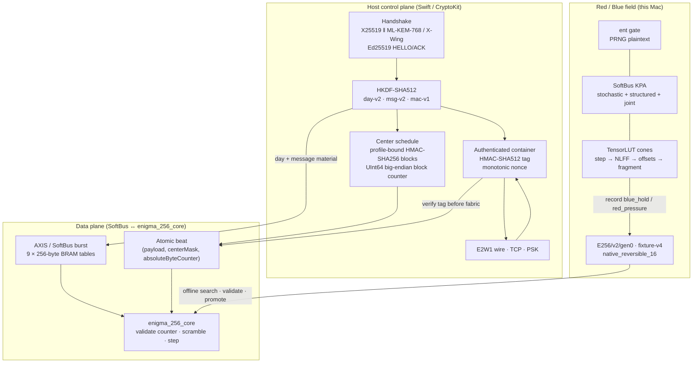
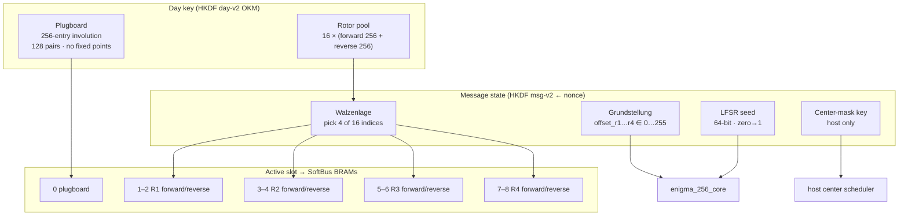
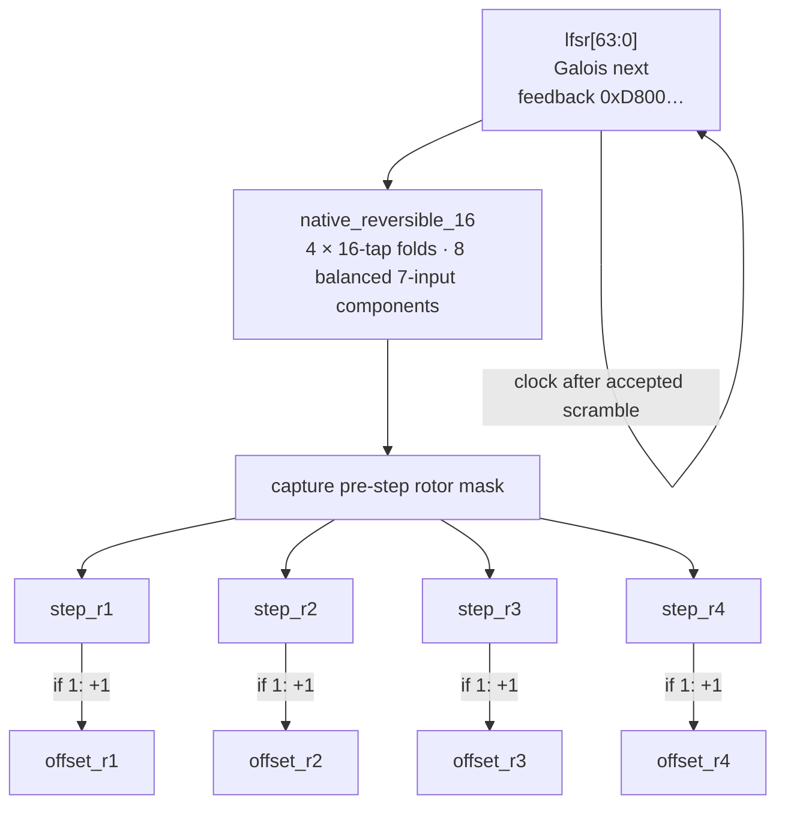
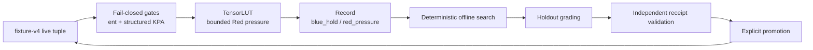

# Specification: Enigma 256 (E256) — Polymorphic Stream Cipher

> **Experimental research prototype. Do not use E256 to protect real data.** The receipts below are bounded implementation evidence, not a security proof or an accepted external cryptographic evaluation.

## Abstract

**E256** is a software-defined, SoftBus-accelerated reciprocal byte machine inspired by historical rotor structure. It replaces the 26-letter path, thin plugboard, odometer stepping, and paper day-key model with a base-256 datapath, a full-spectrum plugboard, four moving rotors, and host-scheduled center masks. Control-plane operations (hybrid KEM, HKDF-SHA512, HMAC-SHA512 container authentication, Ed25519, and the center-mask HMAC) execute on the host; the RTL datapath does not implement HMAC.

The only live compatibility tuple is:

`E256/v2/gen0/fa246e9cba9009a4799e5a81722a9b14e9a67293d9621b45985c5f3e620865d4/fixture-v4`

Runtime campaign mutation is disabled. Deterministic offline search, holdout grading, receipt validation, and explicit promotion are the only profile-change path. Human acceptance finding **E256-003 remains open**.

## Architecture overview

The host derives and transports each center mask and absolute byte counter. RTL validates the supplied counter and applies the supplied mask; it neither stores the HMAC key nor derives HMAC output.

### Byte path (reciprocal)

At byte position `i`, let `A_i` be the current plugboard plus the four forward rotor permutations, including their offsets. The complete byte map is

`A_i^-1(A_i(x) XOR k_i)`

where `k_i` is the host-derived `centerMask` byte. This map is an involution for the frozen state, so encrypt and decrypt use the same path and state. It uses **9 unique 256-byte tables** but **10 serial table accesses**: plugboard entry, four forward rotors, four reverse rotors, and plugboard exit.

```mermaid
flowchart LR
  PT["payload byte x"] --> PB1["plugboard"]
  PB1 --> R1F["R1 forward ± offset"]
  R1F --> R2F["R2 forward ± offset"]
  R2F --> R3F["R3 forward ± offset"]
  R3F --> R4F["R4 forward ± offset"]
  R4F --> XOR["XOR independent centerMask k_i"]
  XOR --> R4R["R4 reverse ± offset"]
  R4R --> R3R["R3 reverse ± offset"]
  R3R --> R2R["R2 reverse ± offset"]
  R2R --> R1R["R1 reverse ± offset"]
  R1R --> PB2["plugboard"]
  PB2 --> CT["output byte"]
```

For a fixed state, the conjugated-XOR map has 256 fixed points when `k_i = 0` and none when `k_i != 0`. That finite identity is a structural diagnostic, not a confidentiality claim.

## The machine (how E256 is put together)

Day-key material is a **256-entry plugboard plus 16 forward/reverse rotor pairs**. There is **no reflector** in the live day key or active hardware slot. Each message nonce selects four active rotors (Walzenlage), four Grundstellung bytes, a 64-bit LFSR seed, and a profile-bound center-mask key. Only the active slot is loaded into BRAM: one plugboard and four forward/reverse rotor pairs, for **9 tables / 2,304 bytes**.

### Exact center schedule and transport boundary

The fixture-v4 schedule separates `centerMask` from the NLFF rotor-step mask:

1. The message KDF derives a 32-byte center-mask key under profile-scoped labels.
2. For absolute byte index `i`, the host selects HMAC-SHA256 block `floor(i / 32)`. The block counter is encoded as **UInt64 big-endian** under the profile-bound center-mask domain.
3. `k_i` is digest lane `i mod 32`; zero is allowed.
4. The host writes `absoluteByteCounter` low word, high word, then `centerMask`, and commits the payload last. The wrapper snapshots `(payload, centerMask, absoluteByteCounter)` atomically, including when jitter delays presentation to the core.
5. RTL accepts a beat only when the transported counter matches its expected counter, then applies `A_i^-1(A_i(x) XOR k_i)`. A mismatch raises `schedule_error` and does not advance the stream state.

`UInt64.max` is exhausted and is never an accepted pre-counter. `UInt64.max - 1` is the final accepted pre-counter; that accepted beat advances the expected counter to `UInt64.max`, with no wrap to zero.

### After the byte: step (sequential)

Order matches Swift, direct RTL, AXI, and SoftBus: validate the transported tuple; emit under the current offsets and independent `centerMask`; step offsets using the captured NLFF mask; clock the LFSR; increment the absolute counter. The center mask is not derived from NLFF parity. The four folds partition all 64 state taps and use all eight balanced components exactly once.

### Planes and trust boundary

| Plane | Runs where | Owns |
|-------|------------|------|
| **Control** | Host Swift | Handshake, IKM, HKDF, container-tag verification, nonce discipline, center-mask HMAC key and blocks, absolute counter transport, `E2W1` |
| **Data** | SoftBus / `enigma_256_core` | Nine BRAM tables, LFSR+NLFF, counter comparison, supplied-mask conjugated-XOR stream |
| **Red** | Yosys + TensorLUT + SoftBus oracles | Narrow cone synthesis/optimization, KPA, `ent`, bounded campaign receipts |
| **Blue genes** | `Fixtures/enigma256_generation.json` | Profile identity, NLFF formula/taps, generation-scoped labels and center-schedule identifiers |

The outer HMAC-SHA512 container tag and the inner HMAC-SHA256 center-mask lane are separate keys and jobs. Verification-before-fabric protects the container boundary; none of the bounded receipts below proves either primitive secure in this composition.

## 1. Architectural corrections (the core machine)

- **Base-256:** alphabet is `0x00…0xFF`; classical 26-letter menus do not transfer directly.
- **Conjugated-XOR center:** `A_i^-1(A_i(x) XOR k_i)`; no live reflector or reserved pair.
- **Full-spectrum plugboard:** 128-pair base-256 involution from day-key OKM.
- **Galois LFSR + native NLFF stepping:** all four active rotors can move every byte; `native_reversible_16` uses four 16-tap folds over eight balanced seven-input components.
- **Host/RTL split:** the host owns HMAC-SHA256 and tuple scheduling; RTL owns counter validation and byte transformation.

## 2. Ephemeral key distribution (handshake)

Control plane only — never implemented in BRAM fabric.

- Ephemeral **X25519**; hybrid **ML-KEM-768** (macOS 26+) → `IKM = X25519_SS ‖ ML-KEM_SS`; optional **X-Wing**.
- Long-term **Ed25519** identities sign hybrid HELLO/ACK (`Enigma256Auth`).
- `burn()` for PFS when the session ends.

## 3. State initialization and key derivation

**HKDF-SHA512** (RFC 5869). Labels include `enigma256-day-v2`, `enigma256-msg-v2`, `enigma256-ecdh-v2`, `enigma256-mac-v1`, and generation/profile-scoped day, message, center-mask-key, and center-mask-block domains.

- IKM: ECDH / hybrid / **PBKDF2-HMAC-SHA512** passphrase (default width 64 B).
- Day OKM: plugboard plus 16 forward/reverse rotor pairs; no reflector.
- Message state: active rotor indices, positions, LFSR seed, and a host-only center-mask key.
- MAC key: a separate expansion, not stream material.

## 4. Message transmission, authentication, and nonce discipline

- Nonce → Walzenlage, Grundstellung, LFSR seed, and center-mask key.
- `E256` version-2 containers carry an HMAC-SHA512 tag over `nonce ‖ ciphertext`; wire/file readers verify the tag before sending ciphertext to SoftBus/AXI.
- `Enigma256ProtectedSession` uses `random[8] ‖ counter_be[8]` and rejects nonce reuse under one IKM.
- This implemented protocol boundary has not received the human acceptance required by **E256-003** and is not recommended for real data.

## 5. Non-linear LFSR stepping (NLFF)

Primitive Galois taps 64, 63, 61, 60 → feedback `0xD800_0000_0000_0000`.

### Live profile

The only loadable identity is the fixture-v4 compatibility tuple printed above. Its formula is `native_reversible_16`:

- four 16-tap folds produce `step_r1…step_r4`;
- each fold XORs two pivot taps with two balanced seven-input components;
- all eight components are assigned exactly once; and
- the four fold tap lists partition state taps `0…63` exactly once.

Swift (`Enigma256Generation.stepMask`) and generated `enigma_256_nlff_v2.vh` implement the same fixture. Loading rejects a mismatched generation, fixture schema, formula, topology, receipt status, profile hash, or compatibility key.

### Quarantined history (non-loadable)

The **E256-v1 gen0…gen5** formula profiles remain autopsy evidence only. They are not fallback profiles and are not selectable by the live decoder.

| Quarantined generation | Historical formula | Historical outcome |
|-----------------------:|--------------------|--------------------|
| 0–2 | `quadratic3` `(a∧b)⊕c` | TensorLUT repeatedly squeezed |
| 3 | `cubic6` fixed taps | TensorLUT hard; **dead middle rotors** |
| 4 | `coupledCubic6` | **Rejected** — correlated steps |
| 5 | `cubic6` bred taps | Superseded; grade contaminated by the older recurrence/control path |

The superseded fixture-v3 bundle, including its historical reflector/reserved-pair center, is retained only at:

`Fixtures/Historical/Enigma256/E256-v2-gen0-2a9f54c70a1619805a911758158f1e2204b0fd96c35102a9db5f4575aeb40cb0-fixture-v3`

It is not the live fixture-v4 machine and must not be used as a compatibility fallback.

## 6. Red / Blue evidence and profile promotion

- **Red:** SoftBus stochastic KPA, structured hill-climb, `ent`, and TensorLUT on expanding cones produce bounded campaign records.
- **Blue:** runtime mutation/force-mutation/breed-apply paths fail closed. Canonical Swift/RTL artifacts change only through deterministic offline search, holdout grading, an accepted receipt, and explicit promotion.

### Validated fixture-v4 receipts

Canonical receipt: `logs/e256-v2-gen0-fixture-v4-validation.json`.

- KAT bundle: **1,024 payload bytes, 9 tables, 10 trace files, 25 artifacts**.
- Swift, direct RTL, AXIS burst, AXI-Lite, and the internal Rust consumer agree within the bounded fixture-v4 parity checks.
- Zero-plaintext equality: **260 / 65,536 = 0.00396729**, with **z = 0.250**. Equality occurs exactly on zero center-mask lanes in this transcript. This is a schedule diagnostic, not a security estimate.
- Post-promotion formal filter: **1/1 PASS**.
- Publication-guard `Enigma256Tests` suite: **49/49 PASS**.
- The Rust result is internal parity, not an immutable external KAT.
- Human acceptance **E256-003 remains open**.

### TensorLUT adversarial cones (bounded surface)

| Cone | Module | Current synthesized size | Bounded meaning |
|------|--------|-------------------------:|-----------------|
| Step | `enigma_256_step_cone` | **145 LUT6 + 64 DFF** | sequential step cone |
| NLFF | `enigma_256_nlff_combo` | **62 LUT6** | step enables only |
| + LFSR hi | `enigma_256_nlff_lfsr_combo` | **77 LUT6** | adds selected next-LFSR outputs |
| + offsets | `enigma_256_nlff_offset_combo` | **112 LUT6** | adds next rotor offsets |
| Scramble fragment | `enigma_256_scramble_frag_combo` | **366 LUT6** | frozen four-rotor fragment with an independent `center_mask` input |
| Full core | `enigma_256_core` | — | not represented by these narrow cones |

TensorLUT log: `logs/tensorlut-enigma256-nlff-v2-gen0-fixture4-fa246e9cba90.log`. The recorded run has `baseline sanity = true`, verdict `blue_hold`, `final_crypto = -291592.781250`, and `final_nonbinary = 1217`. These values record a **bounded optimizer failure on the tested cones only**. They are not a security result, attack work factor, or estimate of cryptanalytic cost.

The scramble fragment receives `center_mask` independently. It does **not** derive HMAC, model tuple transport/counter validation, include the BRAM-loaded full core, or stand in for end-to-end E256.

## 7. Deployment field (Apple Silicon)

- SoftBus is the AXI/AXIS stand-in; iverilog co-sim plus Yosys/TensorLUT is the Red harness.
- A COTS PL board is optional and not on the critical path.
- `SCA_CTRL` can delay stream presentation with jitter. No current receipt establishes side-channel resistance; jitter alone is not side-channel evidence.

## 8. Implementation status

- **Oracle / core:** `Enigma256.swift` ↔ `enigma_256_core.v`; fixture-v4 atomic KAT via `Scripts/enigma256_sim.sh`.
- **Session / authenticated container:** `Enigma256Context`, `Enigma256AEAD`, `Enigma256ProtectedSession`; `E256` version 2.
- **AXI / SoftBus:** selectors `0…8`, 2,304-byte AXIS/SoftBus table burst, atomic `(payload, centerMask, absoluteByteCounter)` beats, counter-error status, and ten serial table accesses per accepted byte. Co-sim: `Scripts/enigma256_axi_sim.sh`.
- **Handshake / wire / TCP / PSK:** hybrid default on macOS 26+; `--enigma256-classical` / `--enigma256-passphrase`.
- **Live profile:** exact compatibility tuple `E256/v2/gen0/fa246e9cba9009a4799e5a81722a9b14e9a67293d9621b45985c5f3e620865d4/fixture-v4`.
- **Campaign:** `Scripts/enigma256_rb_campaign.sh` records `ent`, bounded bijection/reciprocity checks, structured KPA, and TensorLUT pressure. Runtime mutation is disabled.

## 9. Bounded scope and non-claims

The current evidence supports a frozen fixture-v4 implementation/parity statement only. It does **not** establish:

- production suitability, IND-CPA security, unbreakability, or an HMAC security proof;
- an accepted third-party or immutable external KAT;
- that the RTL derives or validates HMAC-SHA256 output rather than trusting the transported mask;
- that TensorLUT’s narrow-cone optimizer failure measures full-core resistance or attack cost;
- side-channel resistance from optional jitter; or
- closure of **E256-003**.

The machine remains experimental and must not be used for real secrets.
